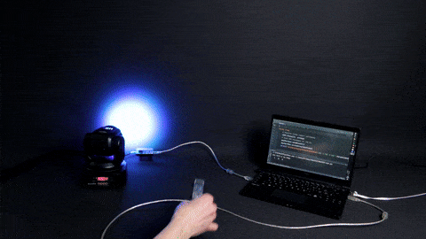

# DMX512 3D handle

This is a demo app showing how to send DMX512 messages using a [Yocto-RS485-V2](https://www.yoctopuce.com/EN/products/usb-electrical-interfaces/yocto-rs485-v2) to drive a DMX moving head wash based on a gyroscopic handle implemented as a [Yocto-3D-V2](https://www.yoctopuce.com/EN/products/usb-position-sensors/yocto-3d-v2)

For more information, see [Yoctopuce blog](https://www.yoctopuce.com/EN/article/communicating-with-dmx512-devices)

